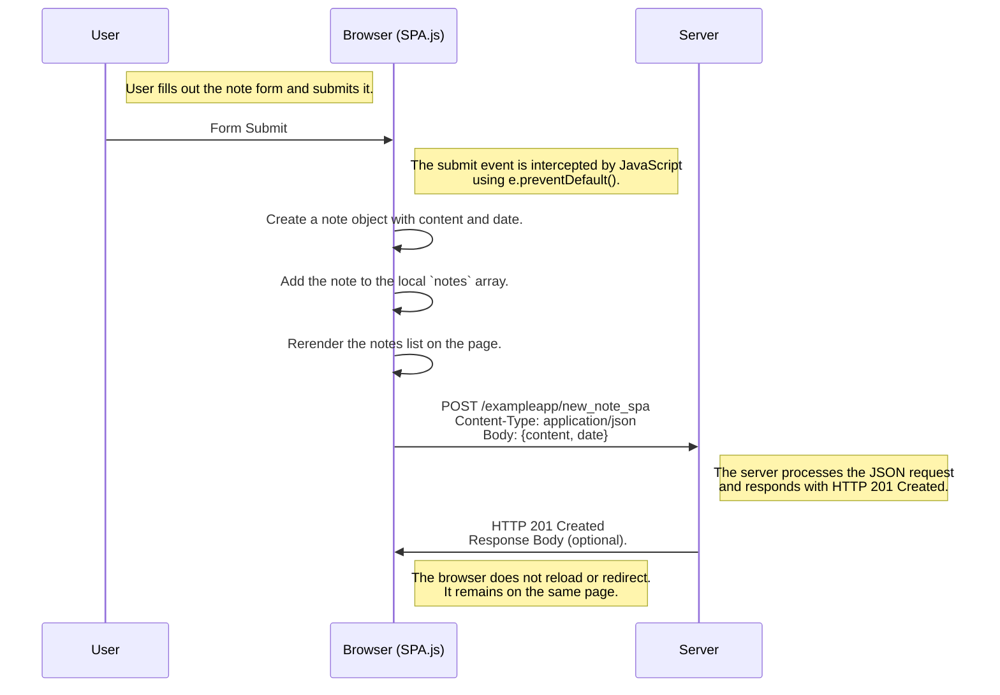

```mermaid
sequenceDiagram
participant User
participant Browser (SPA.js)
participant Server

Note right of User: User fills out the note form and submits it.

User ->> Browser (SPA.js): Form Submit
Note right of Browser (SPA.js): The submit event is intercepted by JavaScript<br> using e.preventDefault().

Browser (SPA.js) ->> Browser (SPA.js): Create a note object with content and date.
Browser (SPA.js) ->> Browser (SPA.js): Add the note to the local `notes` array.
Browser (SPA.js) ->> Browser (SPA.js): Rerender the notes list on the page.

Browser (SPA.js) ->> Server: POST /exampleapp/new_note_spa<br>Content-Type: application/json<br>Body: {content, date}
Note right of Server: The server processes the JSON request<br> and responds with HTTP 201 Created.

Server ->> Browser (SPA.js): HTTP 201 Created<br>Response Body (optional).
Note right of Browser (SPA.js): The browser does not reload or redirect.<br> It remains on the same page.
```
